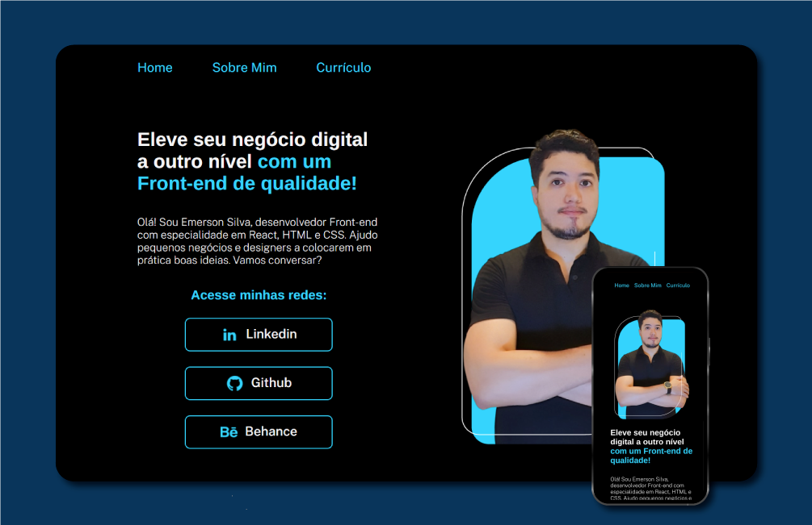

# Portfólio 

Olá, Bem-vindo ao meu projeto de portfólio. Este foi o meu primeiro projeto front-end, criado com a formação de HTML e CSS da Alura.

## Ferramentas utilizadas:

* HTML

* CSS

* Flex-box

## Feito por:

### Emerson Silva

## Acesse minhas redes:
### [Github](https://github.com/Emersonsdev)
### [Linkedin](https://www.linkedin.com/in/emerson-designer)